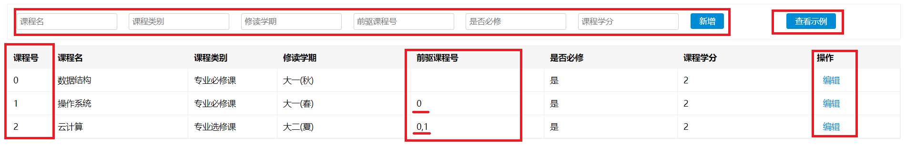
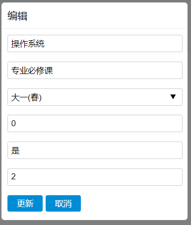
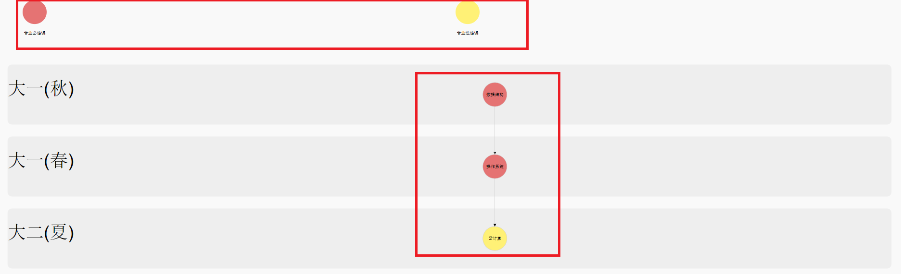
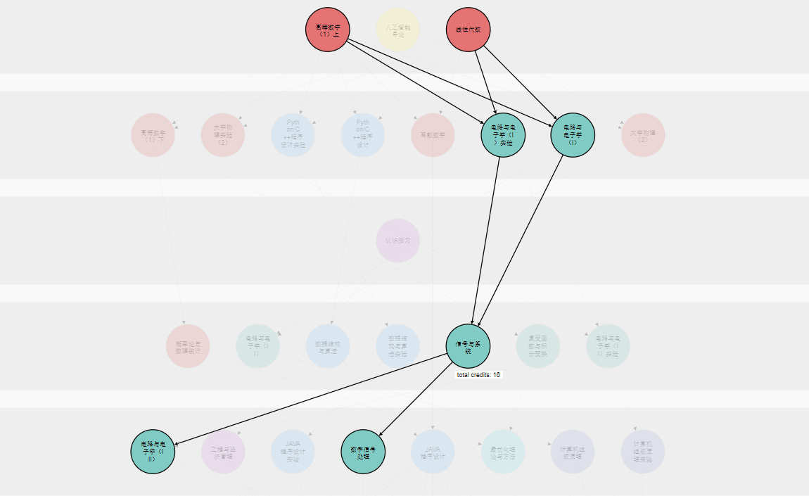
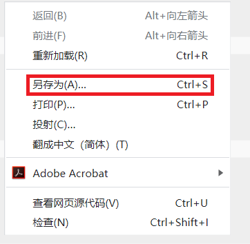

# CourseGuideMap
本项目是基于Bekerley的CourseMap二次开发 https://github.com/compserv/hknweb/wiki/Course-Map
# 使用说明
本项目分为两部分：课程拓扑表和课程拓扑图  
## 课程拓扑表
下载此项目，打开index.html则为课程拓扑表。  

课程拓扑表用于记录课程的信息以及课程之间的关系。   
在上方的表格中输入课程的相关信息，点击新增，下方则会有新增的课程信息。  
其中前驱课程号表示：修读该课程之前要修读的课程号，如有多个课程号，如图例用","分隔开。只需要表示前一层的课程号即可。  
如果课程信息输入有误，请点击最右边的编辑按钮就行修改。  
  
修改完成后，点击更新按钮更新课程信息。若放弃修改，则点击取消按钮。  
输入完课程信息后，点击查看示例可以跳转到课程拓扑图页面。
## 课程拓扑图
    
课程拓扑图上方会显示课程的种类。下方则会显示课程学期以及课程与课程之间的关系。  
   
鼠标在一个课程上悬停，会显示与该课程有关的所有课程关系图，并显示到此课程所需要修读的总学分。  
  
如果需要保存此逻辑拓扑图，点击鼠标右键另存为到本地。
